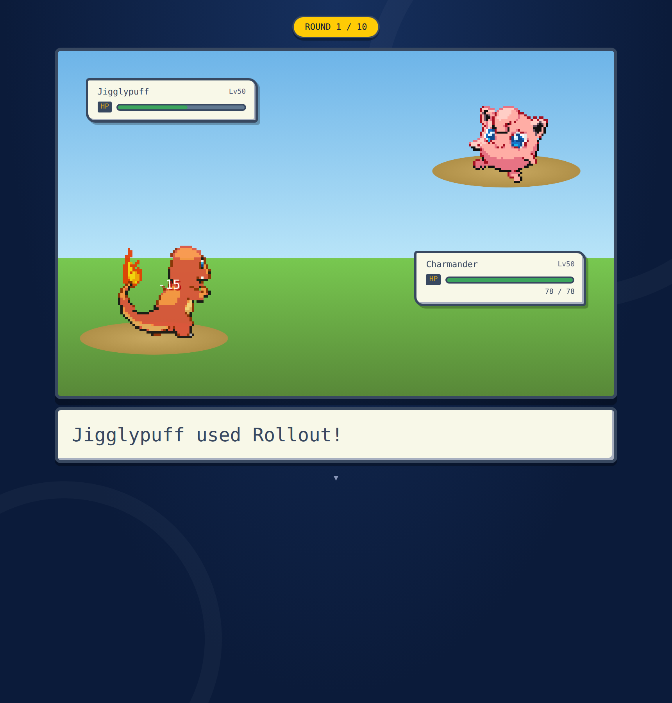
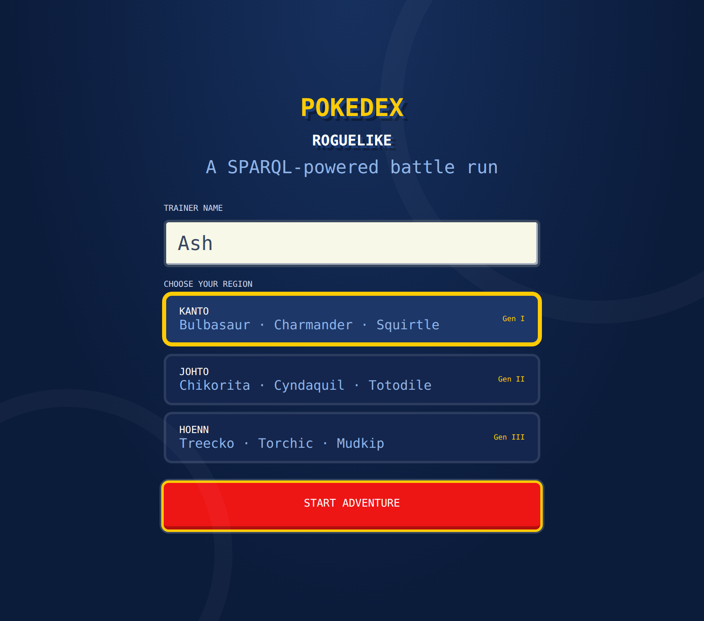
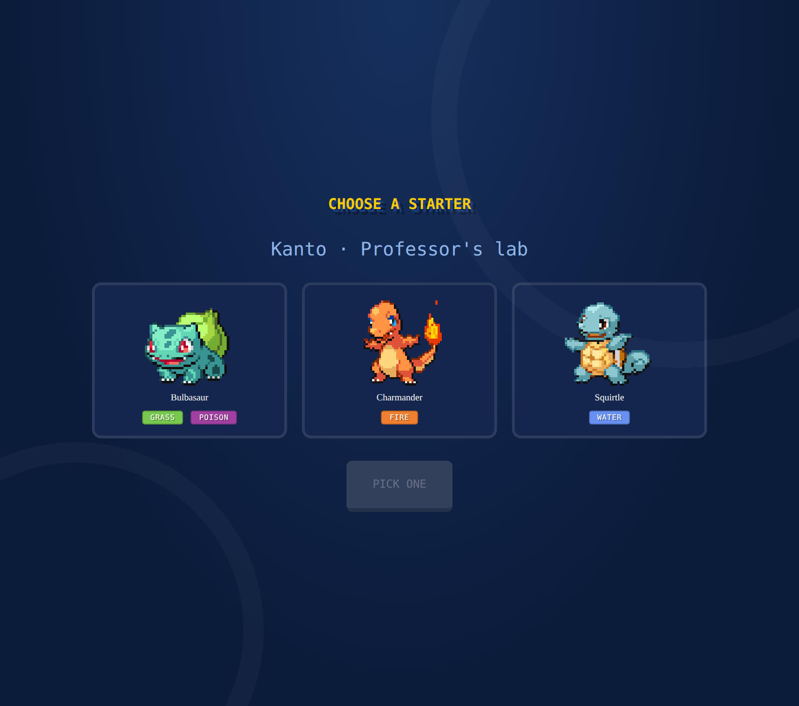

# Pokédex Roguelike 🔴⚪

A turn-based **Pokémon battle roguelike** played in the browser, where the entire
game — team building, opponents, type effectiveness, enemy AI, and evolutions — is
driven by **live SPARQL queries against an OWL knowledge graph** of the Pokémon world
(Generations 1–3).

Built as a project for the *Actionable Knowledge Representation* course at the
**University of Bremen**.



---

## What is this?

Most games hard-code their data. This one doesn't. Every fact the game needs —
a Pokémon's stats, its types, the moves it can learn, which type beats which,
what it evolves into — lives in a formal **OWL ontology** (35,174 triples) and is
fetched at runtime with **SPARQL**.

The result is a small but complete roguelike: pick a starter, build a team of six,
and fight through ten rounds of increasingly tough opponents, evolving your Pokémon
along the way. Lose your whole team and the run is over.

The project has two halves:

1. **The knowledge graph** — a Pokédex ontology covering all 386 Pokémon of
   Generations 1–3, their types, abilities, 864 moves, level-up learnsets, the full
   18×18 type-effectiveness matrix, and evolution chains. Grounded in the
   **SOMA/DUL** upper ontology.
2. **The game** — a React app that queries the ontology over SPARQL and turns it
   into a playable Game Boy Advance–style battle experience.

---

## Play it

### Option A — Instant play (no setup)

The game ships with a bundled offline copy of the ontology data, so it runs
immediately with no database required:

```bash
npm install
npm run dev
```

Open the printed URL (usually `http://localhost:5173`) and play.

> When no SPARQL endpoint is reachable, the game automatically falls back to the
> bundled data. This is the fastest way to try it.

### Option B — The real thing (live SPARQL)

To run it the way it's designed — with queries hitting a live triple store:

1. Install **[Apache Jena Fuseki](https://jena.apache.org/documentation/fuseki2/)**.
2. Start Fuseki and create a dataset named `pokedex`.
3. Upload the ontology file `akr_ontology_kilic_rajput_v8.ttl` to that dataset.
4. Confirm the endpoint is live at `http://localhost:3030/pokedex/sparql`.
5. Run the app:

   ```bash
   npm install
   npm run dev
   ```

The endpoint URL can be changed at the top of `src/hooks/useSparql.js`
(for example to point at a hosted TriplyDB endpoint instead).

---

## How to play

| | |
|---|---|
| **Goal** | Survive all 10 rounds. |
| **Lose** | Your whole team of 6 faints. |
| **Team** | 1 starter you pick + 5 random Pokémon from your chosen region. |
| **Rounds** | 1–3 easy · 4–6 medium · 7–9 hard · 10 = a Legendary boss. |
| **Battles** | Choose which Pokémon fights, then a move. The enemy AI answers with its most effective move. |
| **Type matchups** | Damage uses the real Gen-3 formula and the ontology's effectiveness matrix (dual types stack — Rock hits Fire/Flying for 4×). |
| **PP** | Every move has limited uses. Out of PP → Struggle. |
| **Permadeath** | A fainted Pokémon is gone for the rest of the run, and HP doesn't regenerate… |
| **Evolution** | …except evolving between rounds, which restores full HP and boosts stats. |

<p align="center">
  
  
</p>

---

## How it works

```
 React UI  ──►  SPARQL query strings  ──►  Fuseki / triple store  ──►  ontology
    ▲                                                                      │
    └───────────────  parsed results (Pokémon, moves, effectiveness)  ◄────┘
```

Everything the game does maps to a SPARQL query. A few examples:

- **Pick a starter** → fetch the three starters of a generation.
- **Fill the team** → fetch five random non-legendary Pokémon from that generation.
- **A move connects** → look up its type's effectiveness against the target's types.
- **Enemy's turn** → query for the opponent's strongest *super-effective* move; if
  none exists, its strongest move overall.
- **After a round** → ask whether each surviving Pokémon has an evolution.

All queries live in `src/hooks/queries.js`, and all battle math (damage,
dual-type effectiveness, AI choice, Struggle) lives in `src/utils/battle.js`.

---

## Tech

- **Frontend:** React + Vite
- **Data:** OWL / Turtle ontology, queried via SPARQL (Apache Jena Fuseki)
- **Upper ontology:** SOMA / DUL
- **Sprites:** [PokeAPI](https://pokeapi.co) (front & back, animated)
- **Styling:** hand-written CSS in an authentic Gen-3 (Ruby/Sapphire/Emerald) battle style

### Project layout

```
src/
├── App.jsx                 Screen router (state-driven, no external router)
├── index.css               Full GBA battle theme + animations
├── screens/                Title, starter, team, battle, summary, evolution, win, lose
├── components/             HP box, HP bar, Pokémon card, move button, type badge
├── hooks/
│   ├── useSparql.js        Sends queries to the endpoint (with offline fallback)
│   └── queries.js          All 11 SPARQL queries
├── state/gameState.js      State shape, result parsing, sprite URLs, helpers
├── utils/battle.js         Damage formula, effectiveness, enemy AI, Struggle
└── mock/                   Bundled ontology data for offline play
```

---

## About the ontology

The knowledge graph was built from several sources and merged into a single
consistent file (`akr_ontology_kilic_rajput_v8.ttl`, 35,174 triples):

- **Base Pokémon data** (stats, types, dimensions) via a SPARQL `CONSTRUCT` from a
  public TriplyDB dataset.
- **Evolutions, abilities, moves and Gen-3 learnsets** scraped from *pokemondb.net*
  with Python (`BeautifulSoup` + `rdflib`).
- **The 18×18 type-effectiveness matrix**, modelled by hand.

Domain classes are grounded in the SOMA/DUL upper ontology (Pokémon and Trainers as
agents, moves as actions, types and abilities as concepts, learnsets reified as
situations), and the ontology passes the HermiT reasoner as consistent.

---

## Authors

**Firaz Kılıç** & **Prakhar Rajput** — University of Bremen,
*Actionable Knowledge Representation*.

## Credits & notes

Pokémon and all related names are trademarks of Nintendo / Game Freak / The Pokémon
Company. This is a non-commercial student project for educational purposes. Sprites
are served from PokeAPI.
